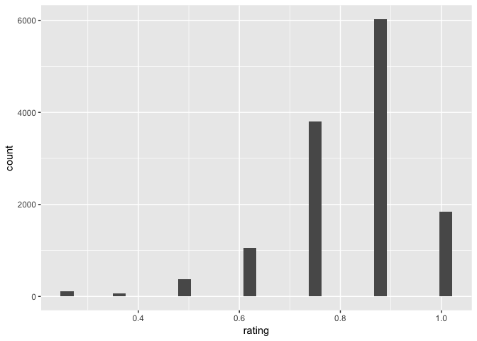
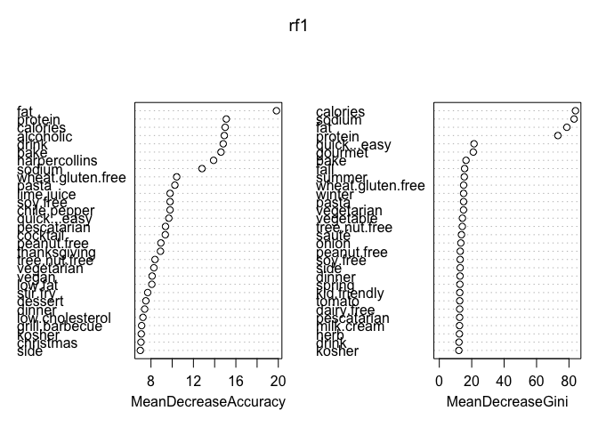
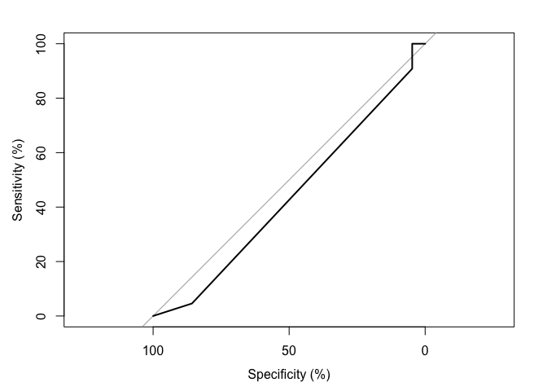

## Linear Regression

In this section, we are interested in predicting dish rating using ingredients as variables. First we built simple linear regression using lm function trying to predict rating. This model uses all the ingredients as variables for the prediction which gives a low square value of 0.072 for the model and rsq = 0.03 for the test data set, the RMSE for the test data set is 0.1276912. 0.03 RSQ means that 3% of the variation in the test data set can be explained by this linear model. However, the 3% isn't ideal, so later we selected statistically significant 4 variables from this model and built interactive terms from these variables. But the result was disappointing because using 4 variables instead of 680 variables for a linear model is definitely under fitting which gave us a even lower rsq for test data set. 


```
##    actuals predicteds
## 1    0.500  0.8414684
## 4    0.625  0.7709445
## 15   1.000  0.8722922
## 23   0.875  0.8588205
## 28   0.500  0.7926398
## 41   0.750  0.8042835
```

The table above shows the sample of the prediction made with the linear model. The "actual" column indicates the actual rating given on the website, the "prediction" column shows the predicted result from this simple linear model. From the chart we can see that the model doesn't predict rating very well especially given by the prediction is on a 0-1 rating scale 


```
## [1] "rmse for the model is  0.1277"
```

```
## [1] "r square is  0.032"
```

The low r square value also confirms the conclusion above. The model can only explain 3% variation in the test data set which means probably ingrediants do not play a significant role in deciding the rating of dishes. 


## Random Forest 
Random forest is another method we used to predict the rating value. The data set was split into 75% data for training set and 25% data for testing data set. We trained the data set by using 10 random variables for the random forest method. The result gives a low Kappa value of 0.0481; kappa value shows how much better does the model perform comparing to a random guess model. A low kappa value and the ROC curve with the model line under the random guess line confirm that the random forest model doesn't explain the data set well. 

<!-- -->

We can see that there's 7 categories of rating therefore in this section we uses classification to predict rating rather than regression. 


```
##       Accuracy          Kappa  AccuracyLower  AccuracyUpper   AccuracyNull 
##   5.877748e-01   2.942505e-01   5.708118e-01   6.045830e-01   4.537790e-01 
## AccuracyPValue  McnemarPValue 
##   3.348127e-54            NaN
```

The table above shows the assessment of random forest model. The accuracy of the model is about 60% with a low p-value. These statistics indicates that the random forest predicted rating classication with high accuracy. 


```r
varImpPlot(rf1, height= 30)
```

<!-- -->

This graph shows the most important features in the random forest model, so overall the most significant features in determinating rating includes, fat, protein, calories, alcohol, whether if the recipe is easy to cook etc. These features indicates that people do care about whether if it healthy food and nutritions while giving rating for the food also simply recipes tends to have higher rating.

<!-- -->

ROC Curve

The graph above shows the roc curve. The diagonol line across the graph represents the accuracy of a randomly assigning 1 out of 7 rating classes. Because our random forest predictor line is really close to that random guessing line, we can conclude that the random forest does not serve as a good model to explain the correlation between ingrediants and rating, which suggests that comparing to ingrediants, how people cook things or the nature of the recipe might play a more significant role in deciding ratings. 

## Boosting 

Another way to improve the accuracy of predicting rating in the data set is to use boosting instead of linear regression model. In this model, we used 5000 as the number of trees because too little trees might result in unbalanced splitting whereas too many trees can be over fitting. The boosting gives a 0.25 square value which means 25% of the variation in the test data can be explained using this model. Comparing to the linear model, boosting has a significant improvement in predicting the closer rating value to the test data set. 


```
## [1] "r square for boosting 0.5147"
```

The relative high r square, 0.25 means that this boosting model can explain 25 % variations in the testing data set. Comparing to the linear regression model which can only explain 3% of the variation, the boosting model has a significant improvement in terms of accuracy. 


