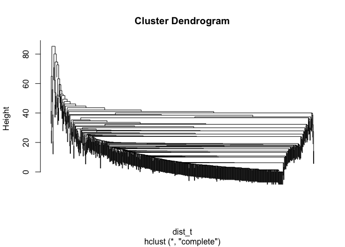
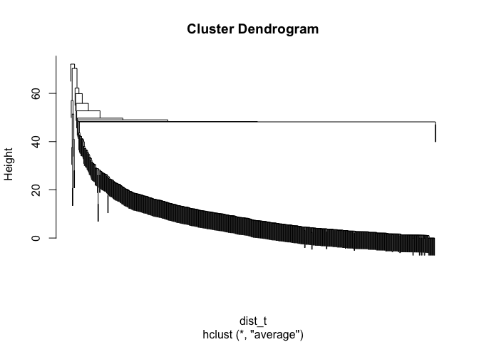
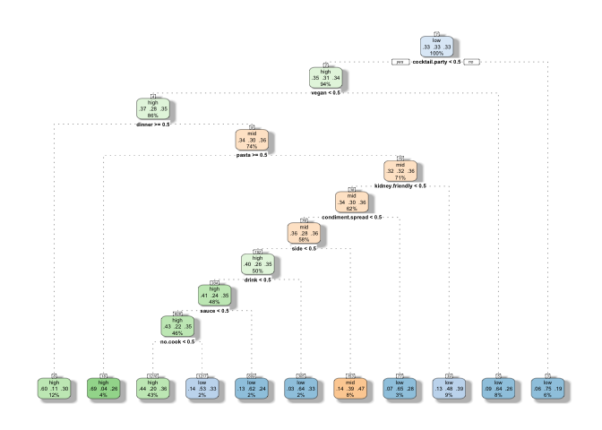
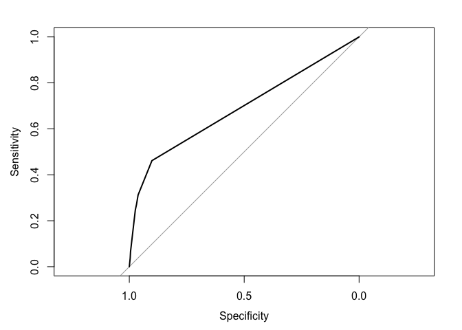
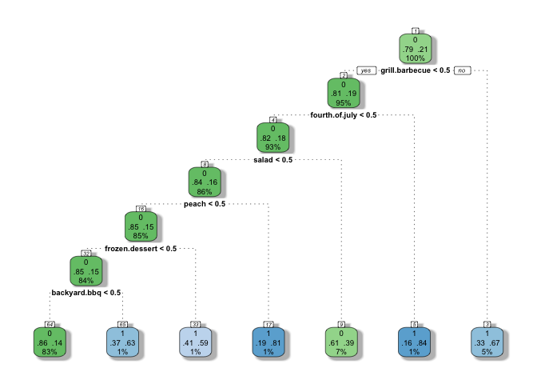

## Overview

In this project we explore a dataset of recipes on the website Epicurious using various machine learning techniques. 

We developed several mini-projects:

* Recipe recommender: a simple recommendation system that helps users find similar recipes to a user-inputted dish based on ingredients

* Clustering: clustering of ingredients based on recipes to find common or interesting ingredient combinations

* Rating: we attempted to predict ratings from ingredients

* Calories: a model that predicts calories based on ingredients

* Summer: a model that tags (classifies) recipes as "summer"-related based on ingredients

See the below sections for more details

*Note: code has been hidden in the document for ease of reading. Check Rmd file for the code*

## Data

### Original Data

The entire dataset can be found on [Kaggle](https://www.kaggle.com/hugodarwood/epirecipes).

There are 20,052 recipes, each with 680 attributes. Here is a sample of the data (only 5 rows and 10 columns are chosen for convenience):

<table class="table" style="margin-left: auto; margin-right: auto;">
 <thead>
  <tr>
   <th style="text-align:left;"> title </th>
   <th style="text-align:right;"> rating </th>
   <th style="text-align:right;"> calories </th>
   <th style="text-align:right;"> protein </th>
   <th style="text-align:right;"> fat </th>
   <th style="text-align:right;"> sodium </th>
   <th style="text-align:right;"> #cakeweek </th>
   <th style="text-align:right;"> #wasteless </th>
   <th style="text-align:right;"> 22-minute meals </th>
   <th style="text-align:right;"> 3-ingredient recipes </th>
  </tr>
 </thead>
<tbody>
  <tr>
   <td style="text-align:left;"> Lentil, Apple, and Turkey Wrap </td>
   <td style="text-align:right;"> 2.500 </td>
   <td style="text-align:right;"> 426 </td>
   <td style="text-align:right;"> 30 </td>
   <td style="text-align:right;"> 7 </td>
   <td style="text-align:right;"> 559 </td>
   <td style="text-align:right;"> 0 </td>
   <td style="text-align:right;"> 0 </td>
   <td style="text-align:right;"> 0 </td>
   <td style="text-align:right;"> 0 </td>
  </tr>
  <tr>
   <td style="text-align:left;"> Boudin Blanc Terrine with Red Onion Confit </td>
   <td style="text-align:right;"> 4.375 </td>
   <td style="text-align:right;"> 403 </td>
   <td style="text-align:right;"> 18 </td>
   <td style="text-align:right;"> 23 </td>
   <td style="text-align:right;"> 1439 </td>
   <td style="text-align:right;"> 0 </td>
   <td style="text-align:right;"> 0 </td>
   <td style="text-align:right;"> 0 </td>
   <td style="text-align:right;"> 0 </td>
  </tr>
  <tr>
   <td style="text-align:left;"> Potato and Fennel Soup Hodge </td>
   <td style="text-align:right;"> 3.750 </td>
   <td style="text-align:right;"> 165 </td>
   <td style="text-align:right;"> 6 </td>
   <td style="text-align:right;"> 7 </td>
   <td style="text-align:right;"> 165 </td>
   <td style="text-align:right;"> 0 </td>
   <td style="text-align:right;"> 0 </td>
   <td style="text-align:right;"> 0 </td>
   <td style="text-align:right;"> 0 </td>
  </tr>
  <tr>
   <td style="text-align:left;"> Mahi-Mahi in Tomato Olive Sauce </td>
   <td style="text-align:right;"> 5.000 </td>
   <td style="text-align:right;"> NA </td>
   <td style="text-align:right;"> NA </td>
   <td style="text-align:right;"> NA </td>
   <td style="text-align:right;"> NA </td>
   <td style="text-align:right;"> 0 </td>
   <td style="text-align:right;"> 0 </td>
   <td style="text-align:right;"> 0 </td>
   <td style="text-align:right;"> 0 </td>
  </tr>
  <tr>
   <td style="text-align:left;"> Spinach Noodle Casserole </td>
   <td style="text-align:right;"> 3.125 </td>
   <td style="text-align:right;"> 547 </td>
   <td style="text-align:right;"> 20 </td>
   <td style="text-align:right;"> 32 </td>
   <td style="text-align:right;"> 452 </td>
   <td style="text-align:right;"> 0 </td>
   <td style="text-align:right;"> 0 </td>
   <td style="text-align:right;"> 0 </td>
   <td style="text-align:right;"> 0 </td>
  </tr>
</tbody>
</table>

Most attributes are one-hot encoded and show the presence of ingredients or tags (e.g. "sandwich", "summer")

### Data Processing

Several steps were done:

* Duplicate recipes are removed

* Rows with NA values are removed

* Columns of "bon appetit" were removed (it indicates the recipe came from the website bon appetit, which does not seem to be informative for our purposes)

* Columns with no variation at all are identified

* Variables calories/fat/sodium/protein were scaled into the range 0 to 1 so as to match the other one-hot encoded variables


After cleaning, there are 14446 recipes


## Recipe Recommender

### Goal

In this part, we aimed to build a simple recommender system that recommends similar recipes from a user-inputted recipe.

To achieve this, we calculated a distance matrix for all recipes and used the distance as a measure of similarity.

The system is implemented in RStudio

### Calculations

Since all variables are within 0~1, a standard distance matrix was calculated for all recipes using Euclidean distance. Only ingredients and tags were used since variables like calorie depend on portions and other things besides culinary similarity (also we have supplied a calorie filter)


### R Shiny App

The system is relatively simple: the user inputs the recipe name (must be exact, but the user can look up names in the About page, where the full table is displayed), and the app looks up in the distance matrix, and outputs a ranked table of recipes ordered by distance to the input recipe.

Several filter options are available: the user can require the presence of ingredients they are interested in, set minimum rating thresholds, or filter by a calorie range

### Example

When we input "Lentil, Apple, and Turkey Wrap", the top 3 recommended dishes are:

* "Pasta with Lentil Bolognese": lentil is the common ingredient

* "Avocado Blts on Toasted Oatmeal Bread": both are sandwich/bread and are savory dishes with a sweat component (apple/oatmeal)

* "Turkey Meat Loaf with Sun-Dried Tomatoes": turkey is the common ingredient, and both involve bread

When we input "Korean Marinated Beef", the top recommended dishes are:

* Mahimahi with Brown-Sugar Soy Glaze: very Asian dish

* Sauteed Skirt Steak: beef is the common star

* Orange-Flavored Beef and Snow Pea Stir-Fry with Noodles: beef is shared, and also is Asian-style

In general, the recommendations do seem to make some sense.

For more examples, try the app

## Clustering

### Goal

In this part, we aimed to cluster ingredients/tags together using recipes. This data can be used to find common combinations of ingredients that people may not be aware of, and inspire them with interesting combinations

### Calculations

We will be clustering 674 ingredients/tags using 14424 recipes (trianing examples)

We chose to use hierarchial clustering due to its flexibility in the number of clusters (different number of clusterings may have different uses, so we chose to leave the option open for the users)

Again, a standard Euclidean distance matrix was used


Three methods are used, which the user is able to choose: complete, average, or Ward's. The method chosen can influence the overall dendrogram structure and specific results


### Visualization

Here are the overall dendrogram structures:

<!-- --><!-- --><!-- -->

All of them show some level of extended, trailing clusters, especially for the "average" method. Using Ward's appears to give a slightly more balanced dendrogram

### Example

The number of clusters is an important factor. Here we will use 20:


```
## 
##   1   2   3   4   5   6   7   8   9  10  11  12  13  14  15  16  17  18 
## 644   1   4   2   1   2   1   1   1   3   1   3   1   1   1   1   1   1 
##  19  20 
##   1   1
```

As you can see, the majority of the attributes were assigned to one group.

Some smaller groups:

* The healthy group:


```
##          features cluster
## 1      dairy free       3
## 2  no sugar added       3
## 3 sugar conscious       3
## 4           vegan       3
```

+ these healthy options are grouped together (interestingly no sugar is grouped with vegan - seems like healthy dishes tend to follow these trends together, but note that gluten-free, vegetarian and others are not grouped here)

* dessert & kidney friendly, interestingly, are grouped together:


```
##          features cluster
## 1         dessert       4
## 2 kidney friendly       4
```


For more exploration, use the App

## Ratings

See linear.md

## Calories

### Goal

In this part we aimed to predict calories based on ingredients. This can be used for recipes that do not report any calorie level, so users can have a sense of the calorie content. Although there are many available products to calculate calorie, our model also gives an example on whether if through purely looking at recipe data, a computer can recognize important ingredients/features related to low/high calorie diet and successfully combine the information for acucrate prediction; and to what extent does presence of ingredients (since our data does not contain quantity) can inform us on calorie

### Data Processing

Here is the five point summary of the raw calorie data:


```
##     Min.  1st Qu.   Median     Mean  3rd Qu.     Max. 
##        0      206      346     6647      601 30111218
```

The median value is around 346. However, the max is 30 million, an unrealistic number likely due to previous data processing errors. Therefore, we filtered out recipes with unreasonable calorie values of over 10,000

To simplify the task, we divided the calories into 3 classes of roughly equal sizes: 

* low: < 250

* mid: 250~500

* high: 500

Variables fat, sodium, and protein are removed since usually if calorie data is missing, these will be missing as well


### Data Partition

We partitioned the data to 75% train (10819 recipes) and 25% test (3605 recipes). 


### Model

We chose to use decision trees because they are more suitable for one-hot encoded variables and are better at handling a large number of variables (also they are easy to interpret so we can see exactly how the model decides).

Due to time limit, we chose to train single-tree models as implemented by rpart, which is significantly faster than other more complex models


### Training


### Result

Here is the model's performance on the training set:


```
## Confusion Matrix and Statistics
## 
##           Reference
## Prediction high  low  mid
##       high 3091 1108 2109
##       low   361 2153 1066
##       mid   132  358  441
## 
## Overall Statistics
##                                          
##                Accuracy : 0.5255         
##                  95% CI : (0.516, 0.5349)
##     No Information Rate : 0.3345         
##     P-Value [Acc > NIR] : < 2.2e-16      
##                                          
##                   Kappa : 0.289          
##  Mcnemar's Test P-Value : < 2.2e-16      
## 
## Statistics by Class:
## 
##                      Class: high Class: low Class: mid
## Sensitivity               0.8624     0.5949    0.12196
## Specificity               0.5554     0.8018    0.93197
## Pos Pred Value            0.4900     0.6014    0.47368
## Neg Pred Value            0.8907     0.7975    0.67890
## Prevalence                0.3313     0.3345    0.33423
## Detection Rate            0.2857     0.1990    0.04076
## Detection Prevalence      0.5830     0.3309    0.08605
## Balanced Accuracy         0.7089     0.6984    0.52697
```

(It is quite similar to performance on test set, and so they are analyzed together below)

Here is the model performance on the test set:


```
## Confusion Matrix and Statistics
## 
##           Reference
## Prediction high  low  mid
##       high 1041  372  736
##       low   116  716  340
##       mid    37  118  129
## 
## Overall Statistics
##                                           
##                Accuracy : 0.5232          
##                  95% CI : (0.5067, 0.5396)
##     No Information Rate : 0.3345          
##     P-Value [Acc > NIR] : < 2.2e-16       
##                                           
##                   Kappa : 0.2856          
##  Mcnemar's Test P-Value : < 2.2e-16       
## 
## Statistics by Class:
## 
##                      Class: high Class: low Class: mid
## Sensitivity               0.8719     0.5937    0.10705
## Specificity               0.5404     0.8099    0.93542
## Pos Pred Value            0.4844     0.6109    0.45423
## Neg Pred Value            0.8949     0.7986    0.67600
## Prevalence                0.3312     0.3345    0.33426
## Detection Rate            0.2888     0.1986    0.03578
## Detection Prevalence      0.5961     0.3251    0.07878
## Balanced Accuracy         0.7061     0.7018    0.52124
```

p-value is small, kappa = 0.29, and accuracy = 0.52: the model is not very accurate in its predictions, but it certainly performs better than random guessing. Its accuracy is high for predicting high & mid, suggesting that ingredients (or at least the ingredients chosen in the tree) are decent indicators for calorie content on the two ends, but are less useful for distinguishing mid-calorie level. The statistics are quite similar to the training performance, indicating that there is no overfitting but underfitting is an issue, so future improvement we can try more complex models, acquire more predictors, or engineer better features. (It does make some sense, though, that our accuracy may not be high, because portion is a major factor on calorie content, and we do not have that data)


Here is a visualization of the tree:

<!-- -->

The tree is quite simple (for example, it will categorize any vegan dish as "low calorie"), but it shows that the computer has been able to recognize important indicators of high/low calorie meals, for example "vegan" or "dinner", without any actual understanding of the words or food. The variable importance shows similar "understanding" of the model on key features influencing calorie content


```
##              feature importance
## 1               side        706
## 2             dinner        425
## 3    kidney.friendly        416
## 4               lamb        344
## 5              vegan        343
## 6            no.cook        287
## 7              drink        275
## 8            chicken        230
## 9              pasta        197
## 10             sauce        195
## 11            rating        191
## 12    cocktail.party        167
## 13 wheat.gluten.free        148
## 14        vegetarian        135
## 15             roast         81
## 16  condiment.spread         73
## 17           cookies         33
```

## Summer

### Goal

In this part, we aimed to predict whether if a dish is summer-themed using ingredients. This can be used to automatically tag recipes online as "summer" and identify ingredients/tags most closely related to summer dishes

### Data Processing

We removed winter, fall, and spring as predictors since it is less useful to predict for a dish has been tagged with a season

Similar to before, the data is divided to 75% train and 25% test.


### Model

Similar to reasons stated before, we chose to use single decision tree as implemented by rpart

### Training


### Results

Here is the model's performance on the training set:


```
## Confusion Matrix and Statistics
## 
##           Reference
## Prediction    0    1
##          0 7519 1428
##          1  341  679
##                                         
##                Accuracy : 0.8225        
##                  95% CI : (0.8149, 0.83)
##     No Information Rate : 0.7886        
##     P-Value [Acc > NIR] : < 2.2e-16     
##                                         
##                   Kappa : 0.3438        
##  Mcnemar's Test P-Value : < 2.2e-16     
##                                         
##             Sensitivity : 0.9566        
##             Specificity : 0.3223        
##          Pos Pred Value : 0.8404        
##          Neg Pred Value : 0.6657        
##              Prevalence : 0.7886        
##          Detection Rate : 0.7544        
##    Detection Prevalence : 0.8977        
##       Balanced Accuracy : 0.6394        
##                                         
##        'Positive' Class : 0             
## 
```

(Again it is quite similar to performance on test set, and so they are analyzed together below)

Here is the model performance on the test set:


```
## Confusion Matrix and Statistics
## 
##           Reference
## Prediction    0    1
##          0 2520  483
##          1  100  219
##                                           
##                Accuracy : 0.8245          
##                  95% CI : (0.8111, 0.8373)
##     No Information Rate : 0.7887          
##     P-Value [Acc > NIR] : 1.338e-07       
##                                           
##                   Kappa : 0.3421          
##  Mcnemar's Test P-Value : < 2.2e-16       
##                                           
##             Sensitivity : 0.9618          
##             Specificity : 0.3120          
##          Pos Pred Value : 0.8392          
##          Neg Pred Value : 0.6865          
##              Prevalence : 0.7887          
##          Detection Rate : 0.7586          
##    Detection Prevalence : 0.9040          
##       Balanced Accuracy : 0.6369          
##                                           
##        'Positive' Class : 0               
## 
```

<!-- -->


p-value is small, kappa = 0.33, accuracy = 0.82, ROC curve is above the random guess: the model is far from perfect, but it certainly performs better than random guessing. 
The statistics are quite similar to the training performance, indicating that there is no overfitting but underfitting is an issue, so for future improvement we can try more complex models or engineer or transform features (for example using word2vec).


Here is a visualization of the tree:

<!-- -->

The tree is again pretty simple, but it does identify some telling indicators (for example barbeque, or fourth of july). The variable importance shows similar "understanding" of the model on key features influencing whether if a dish is summer-related or not (for example identifying peach, lime, cucumber, and blueberry as some summer-themed ingredients)


```
## # A tibble: 13 x 2
##    feature        importance
##    <chr>               <dbl>
##  1 backyard.bbq          492
##  2 fourth.of.july        247
##  3 grill.barbecue        233
##  4 peach                 209
##  5 frozen.dessert        169
##  6 picnic                154
##  7 salad                 145
##  8 lime                  116
##  9 thanksgiving          110
## 10 cucumber               95
## 11 grill                  83
## 12 freeze.chill           35
## 13 blueberry              29
```


